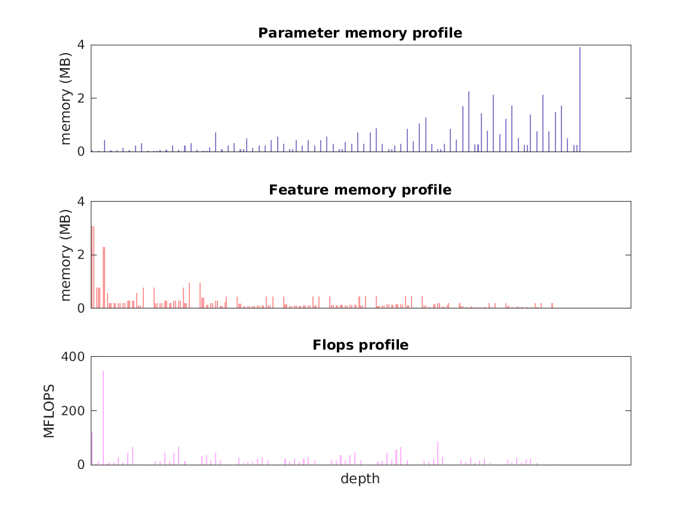

### Report for SE-BN-Inception
Model params 46 MB 

Estimates for a single full pass of model at input size 224 x 224: 

* Memory required for features: 43 MB 
* Flops: 2 GFLOPs 

Estimates are given below of the burden of computing the `inception_5b_scale` features in the network for different input sizes using a batch size of 128: 

| input size | feature size | feature memory | flops | 
|------------|--------------|----------------|-------| 
| 224 x 224 | 7 x 7 x 1024 | 5 GB | 262 GFLOPs |

A rough outline of where in the network memory is allocated to parameters and features and where the greatest computational cost lies is shown below.  The x-axis does not show labels (it becomes hard to read for networks containing hundreds of layers) - it should be interpreted as depicting increasing depth from left to right.  The goal is simply to give some idea of the overall profile of the model: 

