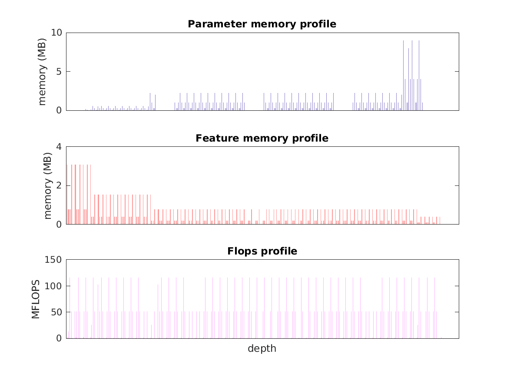

### Report for SE-ResNet-152
Model params 255 MB 

Estimates for a single full pass of model at input size 224 x 224: 

* Memory required for features: 220 MB 
* Flops: 11 GFLOPs 

Estimates are given below of the burden of computing the `conv5_3` features in the network for different input sizes using a batch size of 128: 

| input size | feature size | feature memory | flops | 
|------------|--------------|----------------|-------| 
| 112 x 112 | 4 x 4 x 2048 | 7 GB | 372 GFLOPs |
| 224 x 224 | 7 x 7 x 2048 | 27 GB | 1 TFLOPs |
| 336 x 336 | 11 x 11 x 2048 | 62 GB | 3 TFLOPs |
| 448 x 448 | 14 x 14 x 2048 | 110 GB | 6 TFLOPs |
| 560 x 560 | 18 x 18 x 2048 | 171 GB | 9 TFLOPs |
| 672 x 672 | 21 x 21 x 2048 | 246 GB | 13 TFLOPs |

A rough outline of where in the network memory is allocated to parameters and features and where the greatest computational cost lies is shown below.  The x-axis does not show labels (it becomes hard to read for networks containing hundreds of layers) - it should be interpreted as depicting increasing depth from left to right.  The goal is simply to give some idea of the overall profile of the model: 

