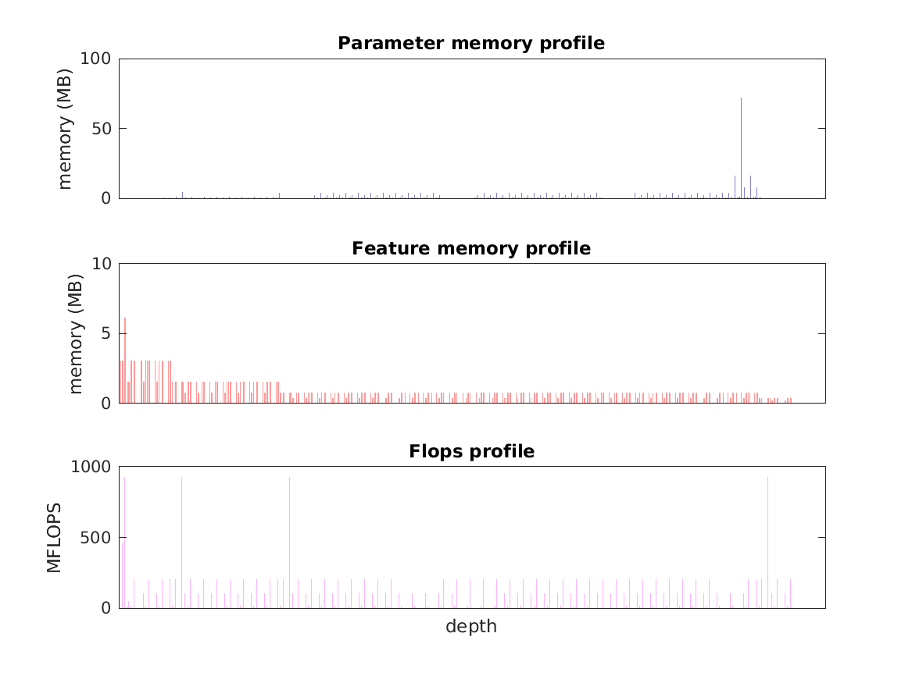

### Report for SENet
Model params 440 MB 

Estimates for a single full pass of model at input size 224 x 224: 

* Memory required for features: 347 MB 
* Flops: 21 GFLOPs 

Estimates are given below of the burden of computing the `conv5_3` features in the network for different input sizes using a batch size of 128: 

| input size | feature size | feature memory | flops | 
|------------|--------------|----------------|-------| 
| 112 x 112 | 4 x 4 x 2048 | 11 GB | 684 GFLOPs |
| 224 x 224 | 7 x 7 x 2048 | 43 GB | 3 TFLOPs |
| 336 x 336 | 11 x 11 x 2048 | 98 GB | 6 TFLOPs |
| 448 x 448 | 14 x 14 x 2048 | 173 GB | 11 TFLOPs |
| 560 x 560 | 18 x 18 x 2048 | 271 GB | 17 TFLOPs |
| 672 x 672 | 21 x 21 x 2048 | 390 GB | 24 TFLOPs |

A rough outline of where in the network memory is allocated to parameters and features and where the greatest computational cost lies is shown below.  The x-axis does not show labels (it becomes hard to read for networks containing hundreds of layers) - it should be interpreted as depicting increasing depth from left to right.  The goal is simply to give some idea of the overall profile of the model: 

