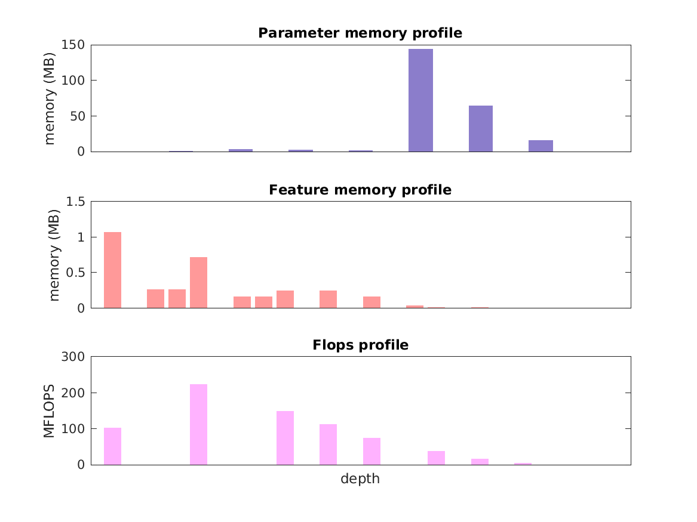

### Report for caffenet
Model params 233 MB 
Estimates for a single full pass of model at input size 224 x 224: 

* Memory required for features: 3 MB 
* Flops: 724 MFLOPS 

Estimates are given below of the burden of computing the `pool5` features in the network for different input sizes: 

| input size | feature size | feature memory | flops | 
 | 112 x 112 | 3 x 3 x 256 | 97 MB | 19 GFLOPS |
 | 224 x 224 | 6 x 6 x 256 | 427 MB | 85 GFLOPS |
 | 336 x 336 | 10 x 10 x 256 | 995 MB | 199 GFLOPS |
 | 448 x 448 | 13 x 13 x 256 | 2 GB | 360 GFLOPS |
 | 560 x 560 | 17 x 17 x 256 | 3 GB | 569 GFLOPS |
 | 672 x 672 | 20 x 20 x 256 | 4 GB | 826 GFLOPS |

A rough outline of where in the network memory is allocated to parameters and features and where the greatest computational cost lies is shown below.  The x-axis does not show labels (it becomes hard to read with the networks containing hundreds of layers) - it should be interpreted as depicting increasing depth from left to right.  The goal is to give some idea of the overall profile of the model: 

