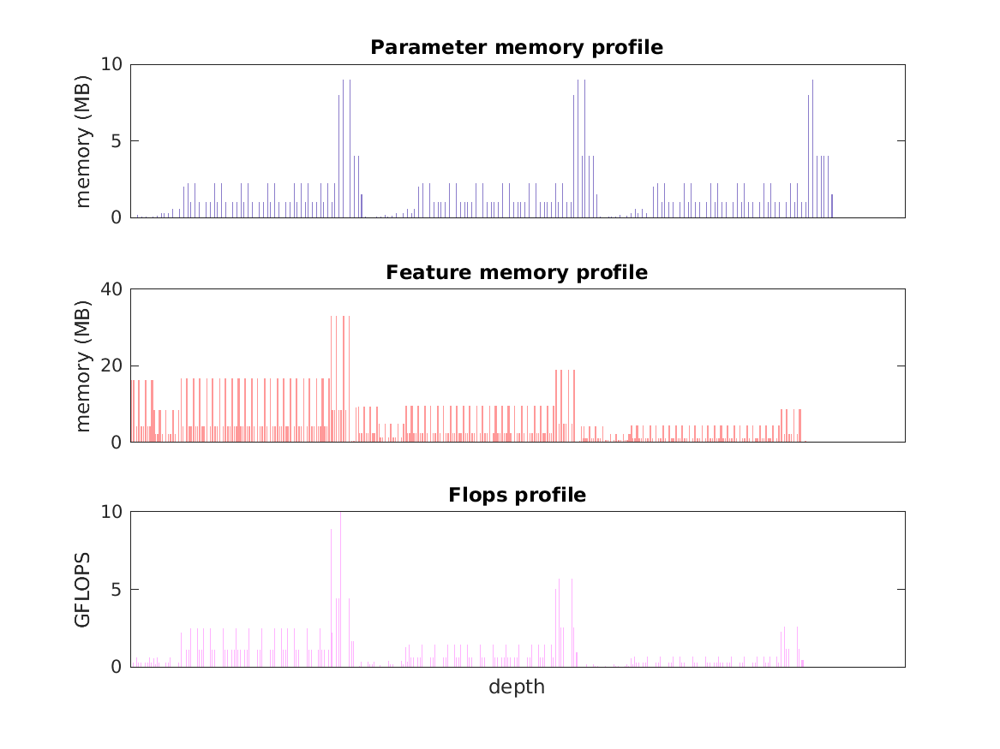

### Report for deeplab-res101-v2
Model params 505 MB 

Estimates for a single full pass of model at input size 513 x 513: 

* Memory required for features: 4 GB 
* Flops: 346 GFLOPs 

Estimates are given below of the burden of computing the `fc1_interp` features in the network for different input sizes using a batch size of 128: 

| input size | feature size | feature memory | flops | 
|------------|--------------|----------------|-------| 
| 257 x 257 | 257 x 257 x 21 | 144 GB | 11 TFLOPs |
| 513 x 513 | 513 x 513 x 21 | 557 GB | 44 TFLOPs |
| 770 x 770 | 769 x 769 x 21 | 1 TB | 98 TFLOPs |
| 1026 x 1026 | 1025 x 1025 x 21 | 2 TB | 174 TFLOPs |
| 1283 x 1283 | 1281 x 1281 x 21 | 3 TB | 271 TFLOPs |
| 1539 x 1539 | 1537 x 1537 x 21 | 5 TB | 389 TFLOPs |

A rough outline of where in the network memory is allocated to parameters and features and where the greatest computational cost lies is shown below.  The x-axis does not show labels (it becomes hard to read for networks containing hundreds of layers) - it should be interpreted as depicting increasing depth from left to right.  The goal is simply to give some idea of the overall profile of the model: 

