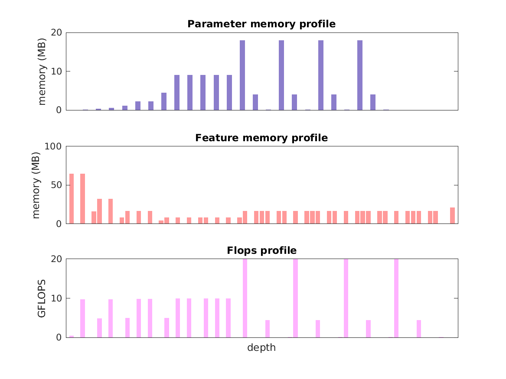

### Report for deeplab-vggvd-v2
Model params 144 MB 

Estimates for a single full pass of model at input size 513 x 513: 

* Memory required for features: 755 MB 
* Flops: 202 GFLOPs 

Estimates are given below of the burden of computing the `fc8_interp` features in the network for different input sizes using a batch size of 128: 

| input size | feature size | feature memory | flops | 
|------------|--------------|----------------|-------| 
| 257 x 257 | 257 x 257 x 21 | 24 GB | 7 TFLOPs |
| 513 x 513 | 513 x 513 x 21 | 94 GB | 26 TFLOPs |
| 770 x 770 | 777 x 777 x 21 | 214 GB | 59 TFLOPs |
| 1026 x 1026 | 1033 x 1033 x 21 | 378 GB | 104 TFLOPs |
| 1283 x 1283 | 1289 x 1289 x 21 | 588 GB | 161 TFLOPs |
| 1539 x 1539 | 1545 x 1545 x 21 | 844 GB | 231 TFLOPs |

A rough outline of where in the network memory is allocated to parameters and features and where the greatest computational cost lies is shown below.  The x-axis does not show labels (it becomes hard to read for networks containing hundreds of layers) - it should be interpreted as depicting increasing depth from left to right.  The goal is simply to give some idea of the overall profile of the model: 

