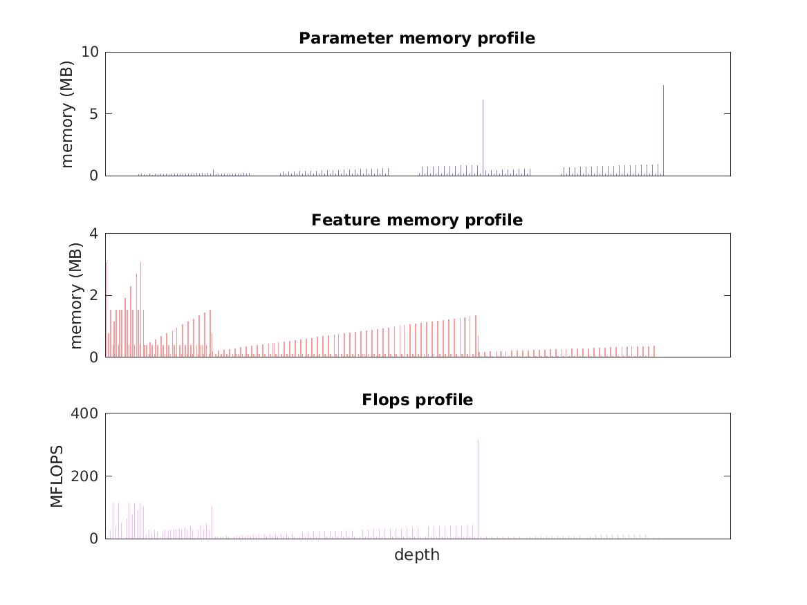

### Report for densenet201
Model params 77 MB 

Estimates for a single full pass of model at input size 224 x 224: 

* Memory required for features: 196 MB 
* Flops: 4 GFLOPs 

Estimates are given below of the burden of computing the `features_2` features in the network for different input sizes using a batch size of 128: 

| input size | feature size | feature memory | flops | 
|------------|--------------|----------------|-------| 
| 224 x 224 | 1 x 1 x 1920 | 25 GB | 556 GFLOPs |
| 336 x 336 | 1 x 1 x 1920 | 55 GB | 1 TFLOPs |
| 448 x 448 | 2 x 2 x 1920 | 98 GB | 2 TFLOPs |
| 560 x 560 | 2 x 2 x 1920 | 152 GB | 3 TFLOPs |
| 672 x 672 | 3 x 3 x 1920 | 221 GB | 5 TFLOPs |

A rough outline of where in the network memory is allocated to parameters and features and where the greatest computational cost lies is shown below.  The x-axis does not show labels (it becomes hard to read for networks containing hundreds of layers) - it should be interpreted as depicting increasing depth from left to right.  The goal is simply to give some idea of the overall profile of the model: 

