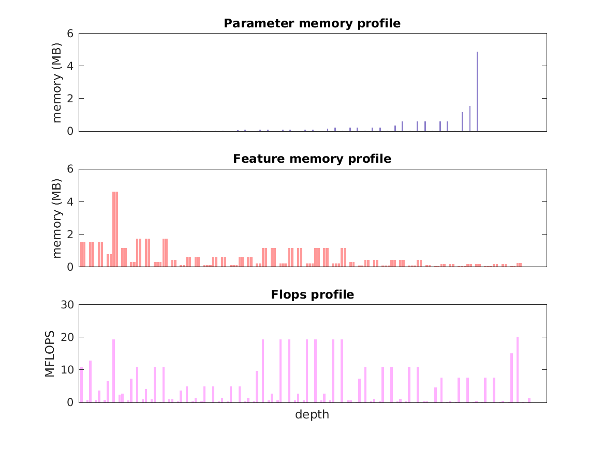

### Report for mcn-mobilenet-v2
Model params 14 MB 

Estimates for a single full pass of model at input size 224 x 224: 

* Memory required for features: 69 MB 
* Flops: 446 MFLOPs 

Estimates are given below of the burden of computing the `fc7` features in the network for different input sizes using a batch size of 128: 

| input size | feature size | feature memory | flops | 
|------------|--------------|----------------|-------| 
| 224 x 224 | 1 x 1 x 1000 | 9 GB | 57 GFLOPs |
| 336 x 336 | 1 x 1 x 1000 | 20 GB | 130 GFLOPs |
| 448 x 448 | 1 x 1 x 1000 | 35 GB | 228 GFLOPs |
| 560 x 560 | 1 x 1 x 1000 | 54 GB | 360 GFLOPs |
| 672 x 672 | 1 x 1 x 1000 | 78 GB | 512 GFLOPs |

A rough outline of where in the network memory is allocated to parameters and features and where the greatest computational cost lies is shown below.  The x-axis does not show labels (it becomes hard to read for networks containing hundreds of layers) - it should be interpreted as depicting increasing depth from left to right.  The goal is simply to give some idea of the overall profile of the model: 

