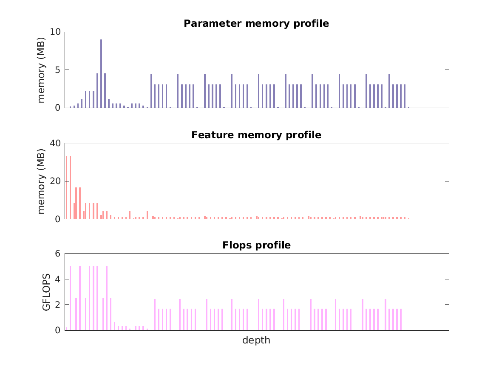

### Report for multipose-coco
Model params 200 MB 

Estimates for a single full pass of model at input size 368 x 368: 

* Memory required for features: 246 MB 
* Flops: 136 GFLOPS 

Estimates are given below of the burden of computing the `Mconv6_stage6_L2` features in the network for different input sizes using a batch size of 128: 

| input size | feature size | feature memory | flops | 
|------------|--------------|----------------|-------| 
| 184 x 184 | 23 x 23 x 128 | 7 GB | 4 TFLOPS |
| 368 x 368 | 46 x 46 x 128 | 30 GB | 16 TFLOPS |
| 552 x 552 | 69 x 69 x 128 | 67 GB | 37 TFLOPS |
| 736 x 736 | 92 x 92 x 128 | 119 GB | 65 TFLOPS |
| 920 x 920 | 115 x 115 x 128 | 186 GB | 101 TFLOPS |
| 1104 x 1104 | 138 x 138 x 128 | 268 GB | 146 TFLOPS |

A rough outline of where in the network memory is allocated to parameters and features and where the greatest computational cost lies is shown below.  The x-axis does not show labels (it becomes hard to read for networks containing hundreds of layers) - it should be interpreted as depicting increasing depth from left to right.  The goal is simply to give some idea of the overall profile of the model: 

