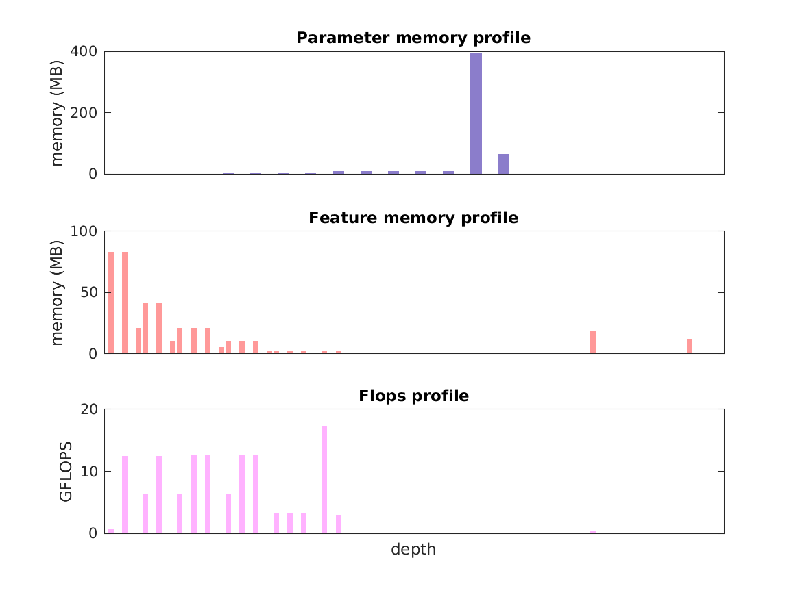

### Report for pascal-fcn8s
Model params 513 MB 

Estimates for a single full pass of model at input size 384 x 384: 

* Memory required for features: 426 MB 
* Flops: 125 GFLOPs 

Estimates are given below of the burden of computing the `score_fr` features in the network for different input sizes using a batch size of 128: 

| input size | feature size | feature memory | flops | 
|------------|--------------|----------------|-------| 
| 192 x 192 | 7 x 7 x 21 | 22 GB | 7 TFLOPs |
| 384 x 384 | 13 x 13 x 21 | 49 GB | 16 TFLOPs |
| 576 x 576 | 19 x 19 x 21 | 87 GB | 29 TFLOPs |
| 768 x 768 | 25 x 25 x 21 | 136 GB | 46 TFLOPs |
| 960 x 960 | 31 x 31 x 21 | 196 GB | 68 TFLOPs |
| 1152 x 1152 | 37 x 37 x 21 | 267 GB | 93 TFLOPs |

A rough outline of where in the network memory is allocated to parameters and features and where the greatest computational cost lies is shown below.  The x-axis does not show labels (it becomes hard to read for networks containing hundreds of layers) - it should be interpreted as depicting increasing depth from left to right.  The goal is simply to give some idea of the overall profile of the model: 

