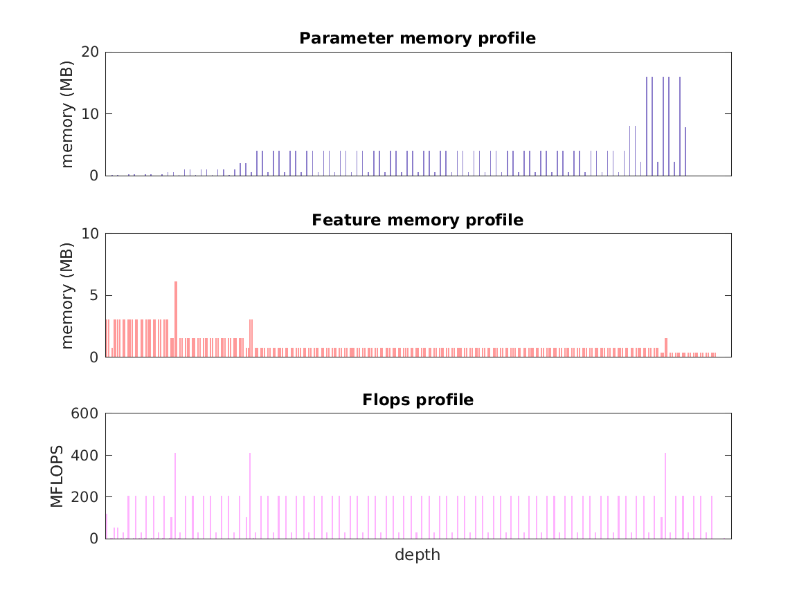

### Report for resnext-101-64x4d
Model params 319 MB 

Estimates for a single full pass of model at input size 224 x 224: 

* Memory required for features: 273 MB 
* Flops: 16 GFLOPS 

Estimates are given below of the burden of computing the `features_7_2_id_relu` features in the network for different input sizes using a batch size of 128: 

| input size | feature size | feature memory | flops | 
|------------|--------------|----------------|-------| 
| 112 x 112 | 4 x 4 x 2048 | 9 GB | 509 GFLOPS |
| 224 x 224 | 7 x 7 x 2048 | 34 GB | 2 TFLOPS |
| 336 x 336 | 11 x 11 x 2048 | 77 GB | 5 TFLOPS |
| 448 x 448 | 14 x 14 x 2048 | 136 GB | 8 TFLOPS |
| 560 x 560 | 18 x 18 x 2048 | 214 GB | 12 TFLOPS |
| 672 x 672 | 21 x 21 x 2048 | 307 GB | 18 TFLOPS |

A rough outline of where in the network memory is allocated to parameters and features and where the greatest computational cost lies is shown below.  The x-axis does not show labels (it becomes hard to read for networks containing hundreds of layers) - it should be interpreted as depicting increasing depth from left to right.  The goal is simply to give some idea of the overall profile of the model: 

