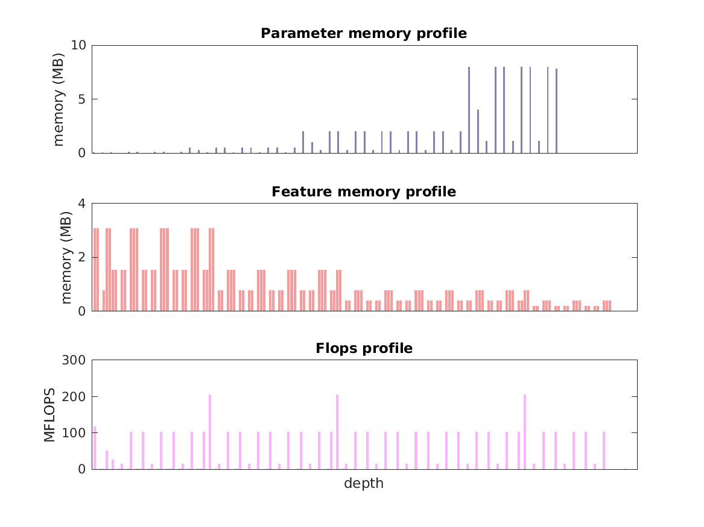

### Report for resnext-50-32x4d
Model params 96 MB 
Estimates for a single full pass of model at input size 224 x 224: 

* Memory required for features: 132 MB 
* Flops: 4 GFLOPS 

Estimates are given below of the burden of computing the `features_7_2_id_relu` features in the network for different input sizes: 

| input size | feature size | feature memory | flops | 
 | 112 x 112 | 4 x 4 x 2048 | 4 GB | 143 GFLOPS |
 | 224 x 224 | 7 x 7 x 2048 | 16 GB | 545 GFLOPS |
 | 336 x 336 | 11 x 11 x 2048 | 37 GB | 1 TFLOPS |
 | 448 x 448 | 14 x 14 x 2048 | 66 GB | 2 TFLOPS |
 | 560 x 560 | 18 x 18 x 2048 | 103 GB | 3 TFLOPS |
 | 672 x 672 | 21 x 21 x 2048 | 148 GB | 5 TFLOPS |

A rough outline of where in the network memory is allocated to parameters and features and where the greatest computational cost lies is shown below.  The x-axis does not show labels (it becomes hard to read with the networks containing hundreds of layers) - it should be interpreted as depicting increasing depth from left to right.  The goal is to give some idea of the overall profile of the model: 

