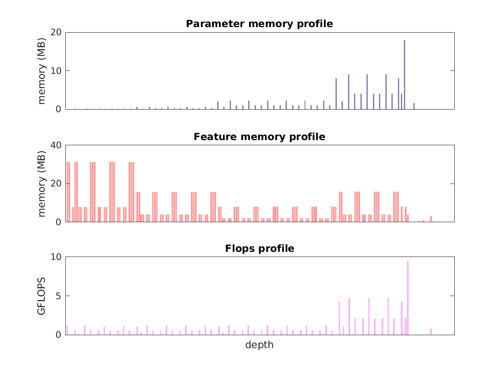

### Report for rfcn-res50-pascal
Model params 122 MB 

Estimates for a single full pass of model at input size 600 x 850: 

* Memory required for features: 1 GB 
* Flops: 79 GFLOPS 

Estimates are given below of the burden of computing the `res5c_relu` features in the network for different input sizes using a batch size of 128: 

| input size | feature size | feature memory | flops | 
|------------|--------------|----------------|-------| 
| 300 x 425 | 19 x 27 x 2048 | 38 GB | 2 TFLOPS |
| 600 x 850 | 38 x 53 x 2048 | 151 GB | 8 TFLOPS |
| 900 x 1275 | 57 x 80 x 2048 | 342 GB | 18 TFLOPS |
| 1200 x 1700 | 75 x 107 x 2048 | 605 GB | 32 TFLOPS |
| 1500 x 2125 | 94 x 133 x 2048 | 944 GB | 50 TFLOPS |
| 1800 x 2550 | 113 x 160 x 2048 | 1 TB | 72 TFLOPS |

A rough outline of where in the network memory is allocated to parameters and features and where the greatest computational cost lies is shown below.  The x-axis does not show labels (it becomes hard to read for networks containing hundreds of layers) - it should be interpreted as depicting increasing depth from left to right.  The goal is simply to give some idea of the overall profile of the model: 

