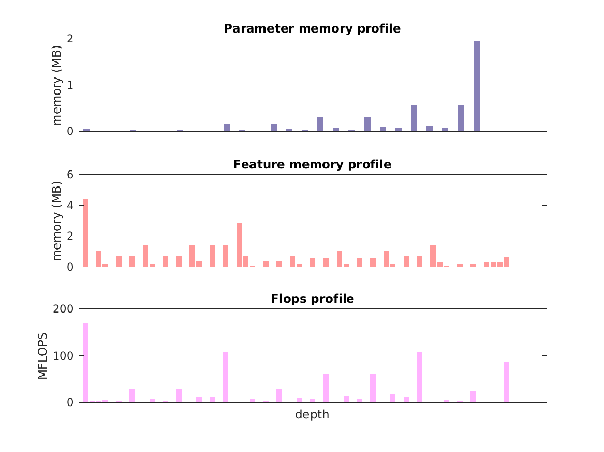

### Report for squeezenet1-0
Model params 5 MB 

Estimates for a single full pass of model at input size 224 x 224: 

* Memory required for features: 30 MB 
* Flops: 837 MFLOPs 

Estimates are given below of the burden of computing the `features_12_cat` features in the network for different input sizes using a batch size of 128: 

| input size | feature size | feature memory | flops | 
|------------|--------------|----------------|-------| 
| 112 x 112 | 6 x 6 x 512 | 841 MB | 22 GFLOPs |
| 224 x 224 | 13 x 13 x 512 | 4 GB | 96 GFLOPs |
| 336 x 336 | 20 x 20 x 512 | 8 GB | 221 GFLOPs |
| 448 x 448 | 27 x 27 x 512 | 15 GB | 398 GFLOPs |
| 560 x 560 | 34 x 34 x 512 | 23 GB | 626 GFLOPs |
| 672 x 672 | 41 x 41 x 512 | 33 GB | 906 GFLOPs |

A rough outline of where in the network memory is allocated to parameters and features and where the greatest computational cost lies is shown below.  The x-axis does not show labels (it becomes hard to read for networks containing hundreds of layers) - it should be interpreted as depicting increasing depth from left to right.  The goal is simply to give some idea of the overall profile of the model: 

