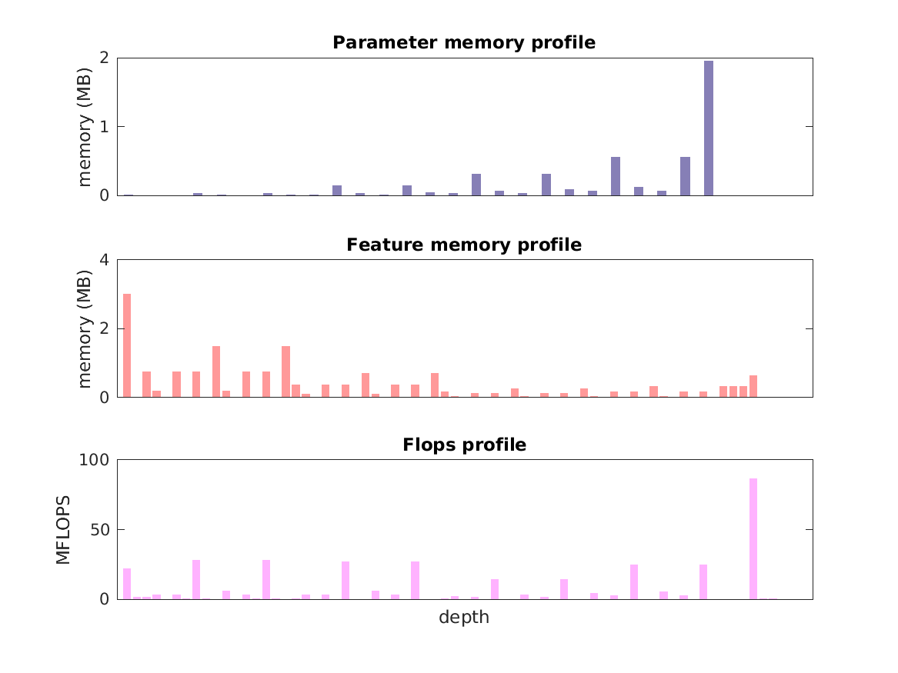

### Report for squeezenet1-1
Model params 5 MB 
Estimates for a single full pass of model at input size 224 x 224: 

* Memory required for features: 17 MB 
* Flops: 360 MFLOPS 

Estimates are given below of the burden of computing the `features_12_cat` features in the network for different input sizes: 

| input size | feature size | feature memory | flops | 
 | 112 x 112 | 6 x 6 x 512 | 483 MB | 8 GFLOPS |
 | 224 x 224 | 13 x 13 x 512 | 2 GB | 35 GFLOPS |
 | 336 x 336 | 20 x 20 x 512 | 5 GB | 81 GFLOPS |
 | 448 x 448 | 27 x 27 x 512 | 8 GB | 146 GFLOPS |
 | 560 x 560 | 34 x 34 x 512 | 13 GB | 230 GFLOPS |
 | 672 x 672 | 41 x 41 x 512 | 19 GB | 333 GFLOPS |

A rough outline of where in the network memory is allocated to parameters and features and where the greatest computational cost lies is shown below.  The x-axis does not show labels (it becomes hard to read with the networks containing hundreds of layers) - it should be interpreted as depicting increasing depth from left to right.  The goal is to give some idea of the overall profile of the model: 

