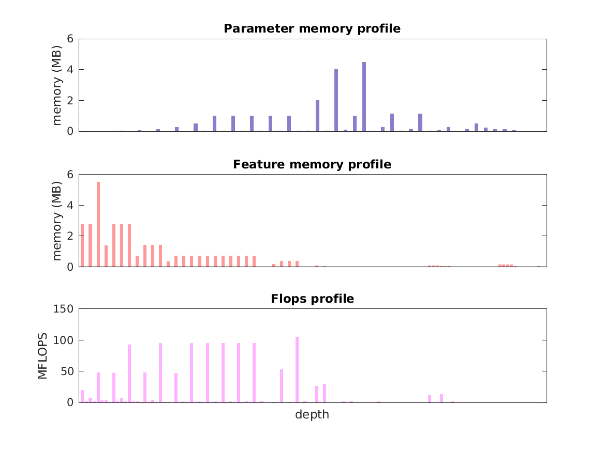

### Report for ssd-pascal-mobilenet-ft
Model params 22 MB 

Estimates for a single full pass of model at input size 300 x 300: 

* Memory required for features: 37 MB 
* Flops: 1 GFLOPs 

Estimates are given below of the burden of computing the `conv17_2_relu` features in the network for different input sizes using a batch size of 128: 

| input size | feature size | feature memory | flops | 
|------------|--------------|----------------|-------| 
| 150 x 150 | 1 x 1 x 128 | 1 GB | 39 GFLOPs |
| 300 x 300 | 1 x 1 x 128 | 4 GB | 146 GFLOPs |
| 450 x 450 | 1 x 1 x 128 | 10 GB | 336 GFLOPs |
| 600 x 600 | 2 x 2 x 128 | 17 GB | 574 GFLOPs |
| 750 x 750 | 2 x 2 x 128 | 27 GB | 890 GFLOPs |
| 900 x 900 | 2 x 2 x 128 | 39 GB | 1 TFLOPs |

A rough outline of where in the network memory is allocated to parameters and features and where the greatest computational cost lies is shown below.  The x-axis does not show labels (it becomes hard to read for networks containing hundreds of layers) - it should be interpreted as depicting increasing depth from left to right.  The goal is simply to give some idea of the overall profile of the model: 

