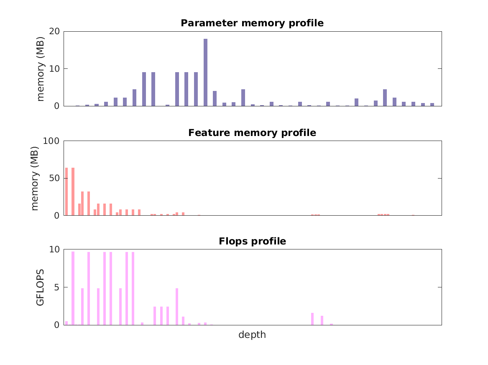

### Report for ssd-pascal-vggvd-512
Model params 104 MB 

Estimates for a single full pass of model at input size 512 x 512: 

* Memory required for features: 337 MB 
* Flops: 91 GFLOPs 

Estimates are given below of the burden of computing the `relu4_3` features in the network for different input sizes using a batch size of 128: 

| input size | feature size | feature memory | flops | 
|------------|--------------|----------------|-------| 
| 256 x 256 | 32 x 32 x 512 | 9 GB | 2 TFLOPs |
| 512 x 512 | 64 x 64 x 512 | 36 GB | 9 TFLOPs |
| 768 x 768 | 96 x 96 x 512 | 82 GB | 21 TFLOPs |
| 1024 x 1024 | 128 x 128 x 512 | 146 GB | 37 TFLOPs |
| 1280 x 1280 | 160 x 160 x 512 | 228 GB | 59 TFLOPs |
| 1536 x 1536 | 192 x 192 x 512 | 328 GB | 84 TFLOPs |

A rough outline of where in the network memory is allocated to parameters and features and where the greatest computational cost lies is shown below.  The x-axis does not show labels (it becomes hard to read for networks containing hundreds of layers) - it should be interpreted as depicting increasing depth from left to right.  The goal is simply to give some idea of the overall profile of the model: 

