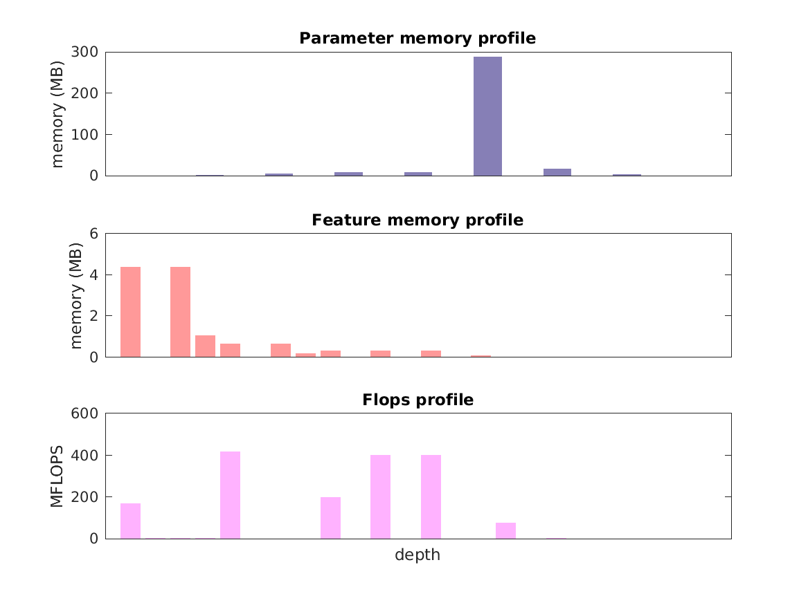

### Report for vgg-m-1024
Model params 333 MB 

Estimates for a single full pass of model at input size 224 x 224: 

* Memory required for features: 12 MB 
* Flops: 2 GFLOPs 

Estimates are given below of the burden of computing the `pool5` features in the network for different input sizes using a batch size of 128: 

| input size | feature size | feature memory | flops | 
|------------|--------------|----------------|-------| 
| 112 x 112 | 3 x 3 x 512 | 365 MB | 44 GFLOPs |
| 224 x 224 | 6 x 6 x 512 | 2 GB | 204 GFLOPs |
| 336 x 336 | 10 x 10 x 512 | 4 GB | 480 GFLOPs |
| 448 x 448 | 13 x 13 x 512 | 6 GB | 874 GFLOPs |
| 560 x 560 | 17 x 17 x 512 | 10 GB | 1 TFLOPs |
| 672 x 672 | 20 x 20 x 512 | 15 GB | 2 TFLOPs |

A rough outline of where in the network memory is allocated to parameters and features and where the greatest computational cost lies is shown below.  The x-axis does not show labels (it becomes hard to read for networks containing hundreds of layers) - it should be interpreted as depicting increasing depth from left to right.  The goal is simply to give some idea of the overall profile of the model: 

