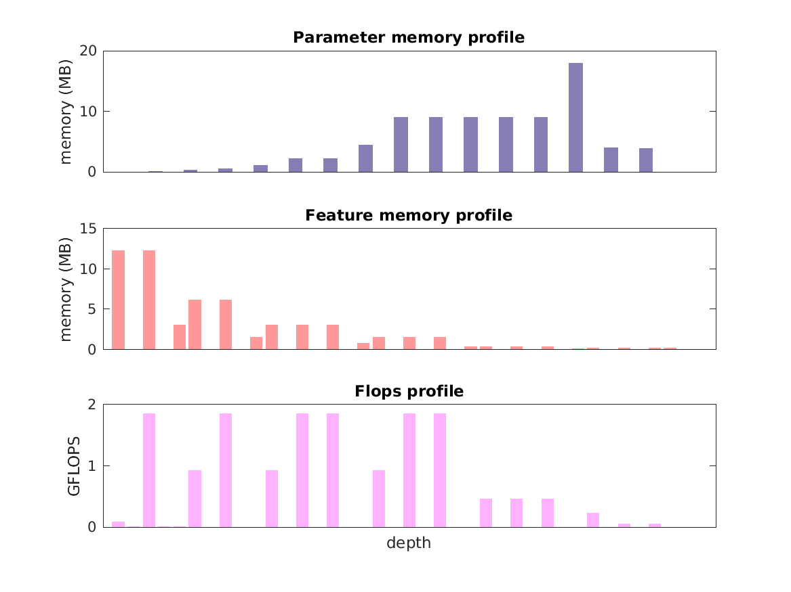

### Report for vgg-vd-16-atrous
Model params 82 MB 
Estimates for a single full pass of model at input size 224 x 224: 

* Memory required for features: 58 MB 
* Flops: 16 GFLOPS 

Estimates are given below of the burden of computing the `pool5` features in the network for different input sizes: 

| input size | feature size | feature memory | flops | 
 | 112 x 112 | 4 x 4 x 512 | 2 GB | 493 GFLOPS |
 | 224 x 224 | 7 x 7 x 512 | 7 GB | 2 TFLOPS |
 | 336 x 336 | 11 x 11 x 512 | 16 GB | 4 TFLOPS |
 | 448 x 448 | 14 x 14 x 512 | 29 GB | 8 TFLOPS |
 | 560 x 560 | 18 x 18 x 512 | 45 GB | 12 TFLOPS |
 | 672 x 672 | 21 x 21 x 512 | 65 GB | 18 TFLOPS |

A rough outline of where in the network memory is allocated to parameters and features and where the greatest computational cost lies is shown below.  The x-axis does not show labels (it becomes hard to read with the networks containing hundreds of layers) - it should be interpreted as depicting increasing depth from left to right.  The goal is to give some idea of the overall profile of the model: 

