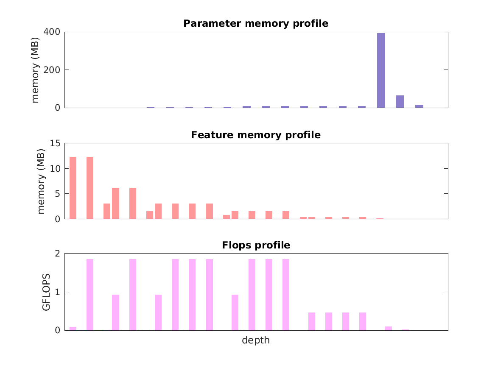

### Report for vgg-vd-19
Model params 548 MB 

Estimates for a single full pass of model at input size 224 x 224: 

* Memory required for features: 63 MB 
* Flops: 20 GFLOPS 

Estimates are given below of the burden of computing the `pool5` features in the network for different input sizes using a batch size of 128: 

| input size | feature size | feature memory | flops | 
|------------|--------------|----------------|-------| 
| 112 x 112 | 4 x 4 x 512 | 2 GB | 626 GFLOPS |
| 224 x 224 | 7 x 7 x 512 | 8 GB | 3 TFLOPS |
| 336 x 336 | 11 x 11 x 512 | 18 GB | 6 TFLOPS |
| 448 x 448 | 14 x 14 x 512 | 31 GB | 10 TFLOPS |
| 560 x 560 | 18 x 18 x 512 | 49 GB | 16 TFLOPS |
| 672 x 672 | 21 x 21 x 512 | 70 GB | 23 TFLOPS |

A rough outline of where in the network memory is allocated to parameters and features and where the greatest computational cost lies is shown below.  The x-axis does not show labels (it becomes hard to read for networks containing hundreds of layers) - it should be interpreted as depicting increasing depth from left to right.  The goal is simply to give some idea of the overall profile of the model: 

